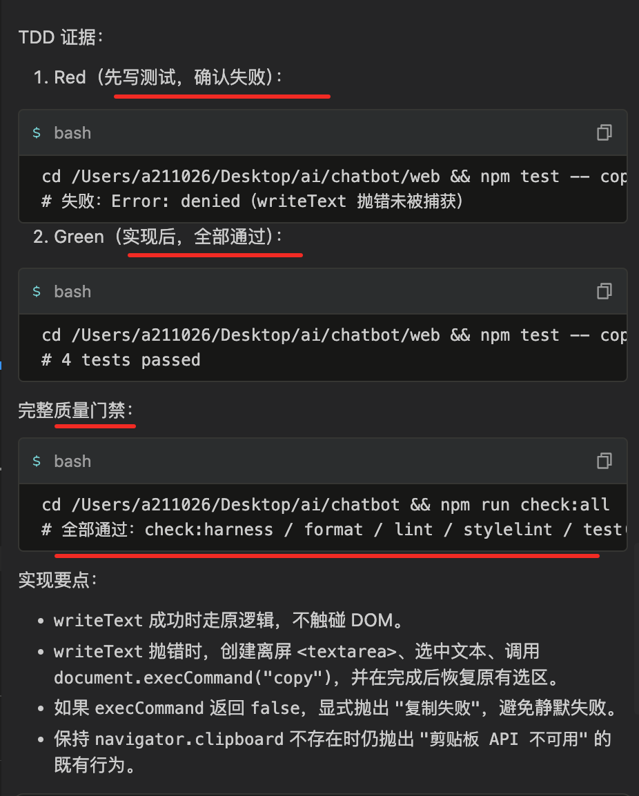

# 完成事项

## 测试先行

### 1、前端测试工具链

Vitest + @testing-library/react + @testing-library/jest-dom + jsdom

借鉴过来的，和 Vite 同生态

### 2、配置

- web/vitest.config.ts
- web/src/test-utils/vitest.setup.ts 初始化文件，统一引入 jest-dom matchers

### 3、测试先行（TDD）作为验收标准

- AI 自觉调用 skill
- 门禁层：防止 AI 绕过或遗忘，在 `pre-push` / `pre-commit` 检查测试是否存在、是否通过。对 bug 修复要求出示 Red 证据（失败测试输出）
- 文档 / 计划层：保留上下文和验收标准，`exec-plan` 里的 `Verification Strategy` 仍然需要，但它应该引用 Skill 和门禁，而不是重复定义。避免"计划写一套、Skill 写一套、门禁又写一套"的漂移。

### 4、组件测试优先用 Testing Library 的 render / user-event 而不是 Enzyme 风格

借鉴 React 组件测试模式

### 5、测试文件平铺在源码同目录

### 6、测试用例少 mock，多用真实实现

因为当前工具函数简单，mock 反而降低测试可信度；等到项目复杂了，用 mock 策略

### 7、把 TDD 触发规则写进 AGENTS.md Default Protocol

想用动作触发的方式让 agent 自动调用 skill

> 未来项目更加复杂考虑 mocks 目录、fixtures、e2e 测试分层等

## 验收测试先行

### 场景1: 新增纯工具函数验证

比如：让 AI 按 TDD 流程新增了 truncateText 工具函数

按照项目约定，AI 会先调用 `test-driven-development` skill 来走测试先行流程;

然后：

- 实现：web/src/utils/truncateText.ts
- 测试：web/src/utils/truncateText.test.ts

验证结果：

- `npm run check:all` 全部通过
- `truncateText` 单测 4 个用例全部通过

### 场景2: bug修复验证

比如：让 AI 修复 `copyToClipboard`，使其在 `navigator.clipboard.writeText` 抛错时，降级使用 `document.execCommand('copy')`。

AI 会先调用相关技能来规范这次代码修复：

- `karpathy-guidelines` Skill
- `test-driven-development` Skill

然后 AI 添加代办：

- 添加 execCommand 降级复制的失败测试
- 运行测试确认失败
- 实现 writeText 抛错时的 execCommand 降级
- 运行测试确认通过
- 运行完整质量门禁

然后修复完之后列出改动文件：

- `web/src/utils/copy.ts` — 增加 try/catch 与 copyWithExecCommand 降级实现
- `web/src/utils/copy.test.ts` — 新增 2 个测试用例

TDD证据如下：

### 场景3: 组件行为变化

比如：让 AI 改造 `InputArea` 组件，使"发送按钮"在 inputText.trim() === '' 时也被 disabled

AI 会先写 web/src/components/InputArea/index.test.tsx，运行后确认空字符串 / 纯空格两个场景失败

测试先行（RED）：

- × 发送按钮在输入为空字符串时被禁用
- × 发送按钮在输入仅包含空白字符时被禁用

实现（GREEN）：

- ✓ 发送按钮在输入为空字符串时被禁用
- ✓ 发送按钮在输入仅包含空白字符时被禁用
- ✓ 发送按钮在输入非空时可用
- ✓ 发送按钮在加载状态时被禁用

门禁测试通过：

- `npm run check:all` 全部通过（`harness / format / lint / stylelint / test / build`）。
- `npm run sync:agents` 已完成（`.claude/` 等副本已同步）。

### 场景4: 重构

这个任务涉及代码改动和新增工具函数，AI 先调用相关技能，然后读取上下文：

- `karpathy-guidelines` Skill
- `test-driven-development` Skill

然后按 TDD 流程：先写测试，看失败，再抽取实现，添加待办：

- 编写 scroll.test.ts，覆盖 30px 阈值边界
- 运行测试，确认 Red（因 scroll.ts 不存在而失败）
- 抽取 checkIsAtBottom 到 web/src/utils/scroll.ts
- 更新 App.tsx 导入并使用新工具函数
- 运行测试，确认 Green，并跑全量检查

然后实现完成。

验证证据：

Red（抽取前，模块不存在导致失败）> Green（抽取后，单文件测试）> 全量检查 npm run check:all > 门禁测试
