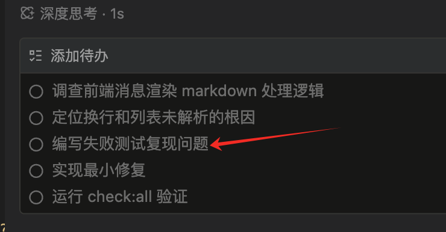

# 完成事项

## 测试先行

### 1、前端测试工具链

Vitest + @testing-library/react + @testing-library/jest-dom + jsdom

借鉴过来的，和 Vite 同生态

### 2、配置

- web/vitest.config.ts
- web/src/test-utils/vitest.setup.ts 初始化文件，统一引入 jest-dom matchers

### 3、测试先行（TDD）作为验收标准

### 4、组件测试优先用 Testing Library 的 render / user-event 而不是 Enzyme 风格

借鉴 React 组件测试模式

### 5、测试文件平铺在源码同目录

### 6、测试用例少 mock，多用真实实现

因为当前工具函数简单，mock 反而降低测试可信度；等到项目复杂了，用 mock 策略

### 7、把 TDD 触发规则写进 AGENTS.md Default Protocol

想用动作触发的方式让 agent 自动调用 skill

> 未来项目更加复杂考虑 mocks 目录、fixtures、e2e 测试分层等

